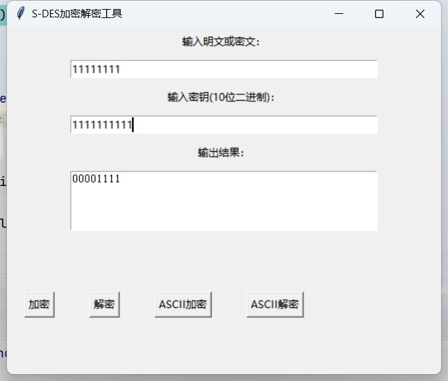
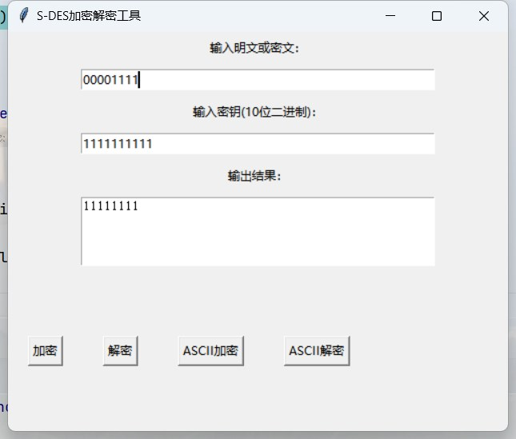
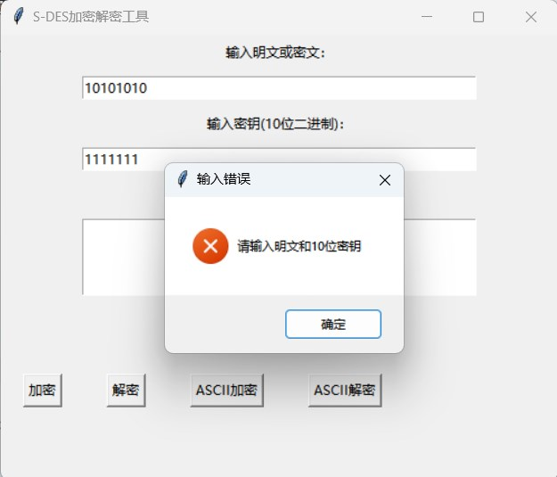
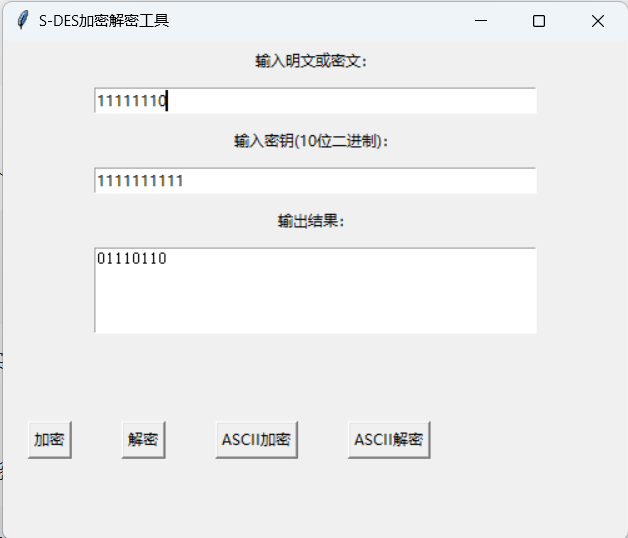

# S-DES_2024
Implementation and exploration of S-DES encryption algorithm
## 关卡测试
***
### 第一关：基本测试
  * 输入明文：“11111111”；输入密钥：“1111111111”；加密结果：“00001111”  

  * 输入密文：“00001111”；输入密钥：“1111111111”；解密结果：“11111111”  

  * 错误输入提示报错  

***
### 第二关：交叉测试
1. 加密  
  明文：11111111  
  密钥：1111111111
* 我们组加密情况：  
 
* 史亚涛组加密情况：  

2. 解密  
  密文：11111110  
  密钥：1111111111  
* 我们组解密情况：  
  
* 史亚涛组解密情况：  

***
### 第三关：扩展功能
考虑到向实用性扩展，加密算法的数据输入可以是ASII编码字符串(分组为1 Byte)，对应地输出也可以是ACII字符串(很可能是乱码)。
1. 字符串加密  
  明文：abandon  
  密钥：1111111111  
  加密结果：CCS–ãS    

3. 字符串解密  
  密文：CCS–ãS  
  密钥：1111111111  
  解密结果：abandon  

***
### 第四关：暴力破解
假设你找到了使用相同密钥的明、密文对(一个或多个)，请尝试使用暴力破解的方法找到正确的密钥Key。在编写程序时，你也可以考虑使用多线程的方式提升破解的效率。请设定时间戳，用视频或动图展示你在多长时间内完成了暴力破解。  
* 方法分析：  
    知道一对或多对明密文对，且知道密钥为10bit二进制，因此一共有1024种密钥情况。采用多线程遍历的方法暴力求解。
* 性能分析：  
    为了第五关的测试、我们要遍历所有的密钥、因此中途不停止搜索。记录开始破解到找到第一个密钥的时间、即为破解时间。
* 测试：  
    如果知道明密文对("11111111", "00001111")，暴力破解结果如下：　　
  Found 3 key(s): ['0111111101', '1110110111', '1111111111']　　 
  Time to find the first key: 0.0090 seconds　　
  Total brute force time: 0.0176 seconds
***
### 第五关：封闭测试
根据第4关的结果，进一步分析，对于你随机选择的一个明密文对，是不是有不止一个密钥Key？进一步扩展，对应明文空间任意给定的明文分组P_{n}，是否会出现选择不同的密钥K_{i}\ne K_{j}加密得到相同密文C_n的情况？

   
   
  
