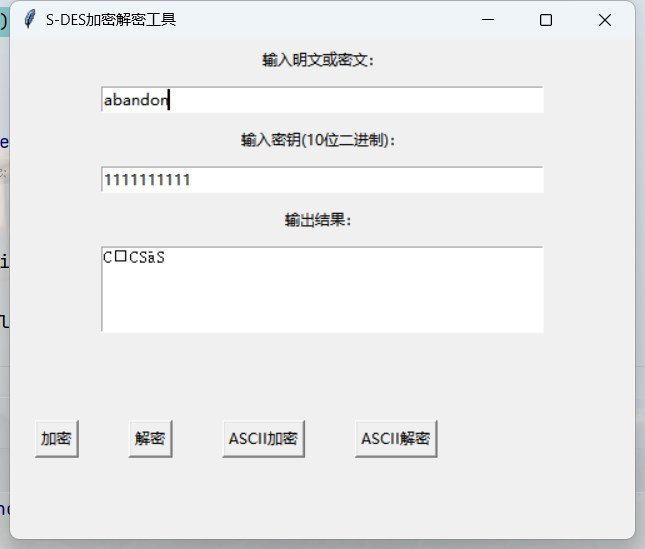

# S-DES_2024
Implementation and exploration of S-DES encryption algorithm
## 关卡测试
***
### 第一关：基本测试
  * 输入明文：“11111111”；输入密钥：“1111111111”；加密结果：“00001111”  

  * 输入密文：“00001111”；输入密钥：“1111111111”；解密结果：“11111111”  

  * 错误输入提示报错  

***
### 第二关：交叉测试
1. 加密  
  明文：11111111  
  密钥：1111111111
* 我们组加密情况：  
 
* 史亚涛组加密情况：  

2. 解密  
  密文：11111110  
  密钥：1111111111  
* 我们组解密情况：  
  
* 史亚涛组解密情况：  

***
### 第三关：扩展功能
考虑到向实用性扩展，加密算法的数据输入可以是ASII编码字符串(分组为1 Byte)，对应地输出也可以是ACII字符串(很可能是乱码)。
1. 字符串加密  
  明文：abandon  
  密钥：1111111111  
  加密结果：CCS–ãS    

3. 字符串解密  
  密文：CCS–ãS  
  密钥：1111111111  
  解密结果：abandon  

***
### 第四关：暴力破解
假设你找到了使用相同密钥的明、密文对(一个或多个)，请尝试使用暴力破解的方法找到正确的密钥Key。在编写程序时，你也可以考虑使用多线程的方式提升破解的效率。请设定时间戳，用视频或动图展示你在多长时间内完成了暴力破解。  
* 方法分析：  
    知道一对或多对明密文对，且知道密钥为10bit二进制，因此一共有1024种密钥情况。采用多线程遍历的方法暴力求解。
* 性能分析：  
    为了第五关的测试、我们要遍历所有的密钥、因此中途不停止搜索。记录开始破解到找到第一个密钥的时间、即为破解时间。
* 测试：  
    如果知道明密文对`("11111111", "00001111")`，暴力破解结果如下：  
  `Found 3 key(s): ['0111111101', '1110110111', '1111111111']`  
  `Time to find the first key: 0.0090 seconds`  
  `Total brute force time: 0.0176 seconds`  
***
### 第五关：封闭测试
根据第4关的结果，进一步分析，对于你随机选择的一个明密文对，是不是有不止一个密钥Key？进一步扩展，对应明文空间任意给定的明文分组P_{n}，是否会出现选择不同的密钥K_{i}\ne K_{j}加密得到相同密文C_n的情况？
* 随机选择一个明密文对，是否可能不止有一个密钥？  
  在对称加密算法中，由于密钥空间有限，不同密钥可能产生相同的加密结果。理论上来说，任何明文分组与密文分组之间的映射关系，可能对应多个密钥。由于 S-DES 的密钥空间较小，10位的密钥长度产生的可能密钥数为1024，密钥冲突的概率增加。
  在暴力破解时，使用明密文对`("11111111", "00001111")`，求解的可能密钥有三种:  
     `['0111111101', '1110110111', '1111111111']`
  作证这个结果
* 对于任意给定的明文分组 P_n，是否存在不同密钥 K_i ≠ K_j 加密得到相同密文 C_n 的情况？  
  对于给定的明文分组 P_n，确实有可能不同的密钥 K_i 和 K_j 加密该明文得到相同的密文 C_n。原因如下：
  1. 密钥空间有限：如果密钥空间较小，可能的密钥数量有限，而明文与密文的组合数量在理论上是固定的。因此，当密钥数量小于密文空间时（即密钥长度较短的算法），必然存在多个密钥可以映射到同一个密文，导致密钥冲突。
  2. 生日攻击问题：这是一个经典的概率问题，类似于生日悖论。即使密钥空间较大，仍然存在相当高的概率，某些不同的密钥可能生成相同的密文。密钥空间越小，这种冲突发生的概率就越高。  
  使用`find_key_collisions`函数找出所有密钥冲突
```
def find_key_collisions(plain_text):
    # 密钥空间大小
    key_space = 1024  # 10位二进制密钥的所有可能性
    collision_dict = defaultdict(list)  # 存储密文和对应的密钥列表

    # 遍历所有可能的密钥
    for key in range(key_space):
        # 将密钥转换为10位二进制格式
        key_bin = format(key, '010b')
        # 使用该密钥加密明文
        cipher_text = S_DES.s_des_encrypt(plain_text, key_bin)
        # 将加密结果存储在字典中，密文作为键，密钥作为值
        collision_dict[cipher_text].append(key_bin)

    # 查找有冲突的密文
    collisions = {cipher: keys for cipher, keys in collision_dict.items() if len(keys) > 1}

    # 输出冲突结果
    if collisions:
        print("Found key collisions!")
        for cipher, keys in collisions.items():
            print(f"Cipher Text: {cipher} - Keys: {keys}")
    else:
        print("No key collisions found.")

    return collisions
```
  使用明文`00001111`进行加密对应不同的密文密钥情况如下（部分）：
  ```
Cipher Text: 00010101 - Keys: ['0000000000', '0010000101', '0010100000']
Cipher Text: 01010100 - Keys: ['0000000001', '0000010101', '0010100100'] 
Cipher Text: 01010111 - Keys: ['0000000010', '0000001010', '0000110011', '0000111011', '0010110110', '0010111110', '1100110011', '1101111011']
Cipher Text: 11010110 - Keys: ['0000000011', '0000001011', '0010000110', '0010001110', '0010110010', '0010111010', '1110000110', '1110110010', '1111001110', '1111111010']
Cipher Text: 01111000 - Keys: ['0000000100', '0000110100', '0111001011', '1100001110', '1100111110', '1101000110', '1101110110']
Cipher Text: 00111001 - Keys: ['0000000101', '1100001111', '1101000111']
Cipher Text: 11111010 - Keys: ['0000000110', '0000001110']
```


   
   
  
